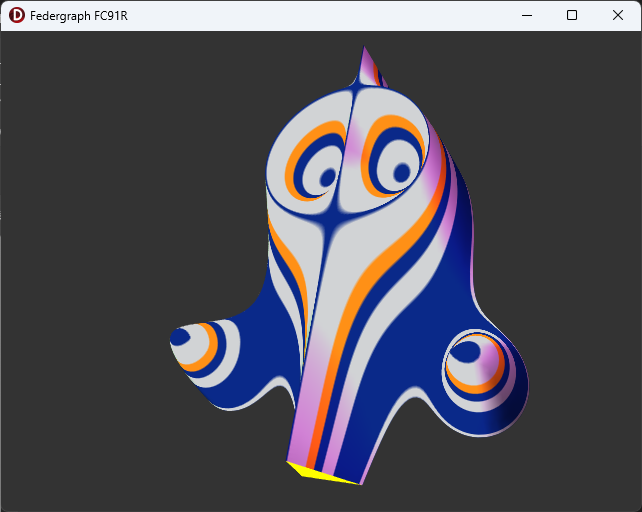
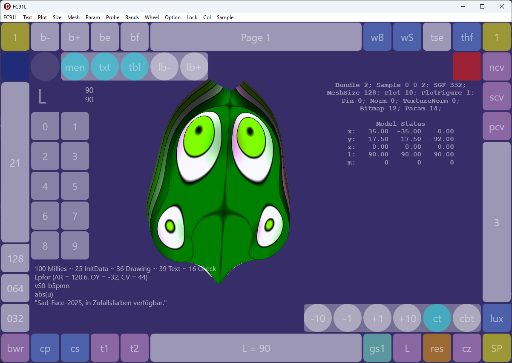
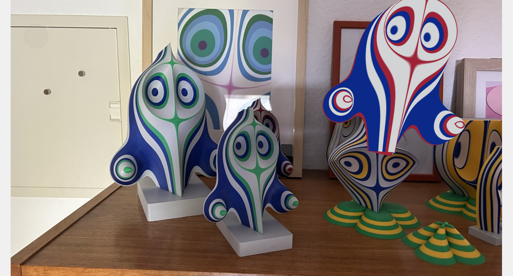

# Federgraph FC91

The Federgraph app is a cross-platform Delphi App, using FMX.

The head of repository contains the demo app, kind of a minimal app.

More complicated versions of the app live in branches.

Primarily, the app plots a 3D surface, from the Federgraph formula.

But as you can see in the image above, it is possible to export an .obj file containing the mesh data, and use that to create the 3D-printed figure. The code in this repository contains optimizations for this purpose.
